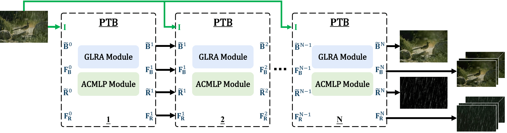

# Multi-stage Partitioned Transformer (MPT)

Pytorch Implementation of "Multi-Stage Partitioned Transformer for Efficient Image Deraining"

## Introduction
Images shot outdoors may capture rain, which can be troublesome to view the clean scene and significantly degrade their visual quality. Since rain scenes vary due to rain's density and wind directions, removing rain streaks from a rainy image is difficult. Thanks to the recent success of transformers in vision tasks, we propose a novel Multi-stage Partitioned Transformer (MPT) specifically for image deraining. MPT separates the attention module and multi-layer perceptron (MLP) to decompose the rain layer and the clean background from a rainy image. It utilizes the proposed global and local rain-aware attention mechanism to estimate the rain layer. In addition, we add atrous convolutions to MLP to aggregate contextualized background features to produce a clean background at multiple stages. MPT is a parameter-economical and computationally efficient deraining model that can effectively remove rain streaks from the input rainy image. Experimental results demonstrate that the proposed MPT performs favorably against state-of-the-art models in image deraining on benchmark datasets.

## Network Architecture of MPT



<details>
<summary><strong>Performance comparison on the five test dataset in terms of deraining quality
and model size (number of parameters in million).</strong> (click to expand) </summary>
 
</details>

## Dataset Descriptions 
#### Synthetic datasets
* **Rain100L**: 200 training pairs and 100 test pairs *[[paper](http://openaccess.thecvf.com/content_cvpr_2017/papers/Yang_Deep_Joint_Rain_CVPR_2017_paper.pdf)][[dataset](http://www.icst.pku.edu.cn/struct/Projects/joint_rain_removal.html)](2017 CVPR)*
* **Rain100H**: 1254 training pairs and 100 test pairs *[[paper](http://openaccess.thecvf.com/content_cvpr_2017/papers/Yang_Deep_Joint_Rain_CVPR_2017_paper.pdf)][[dataset](https://github.com/nnUyi/DerainZoo/blob/master/DerainDatasets.md)](2017 CVPR)*
* **Rain800**: 700 training pairs and 98 test pairs (we drop 2 images from 100 test images as the images are too large)
* **Rain1400(DDN-Data)**: 12600 training pairs and 1400 test pairs *[[paper](http://openaccess.thecvf.com/content_cvpr_2017/papers/Fu_Removing_Rain_From_CVPR_2017_paper.pdf)][[dataset](https://xueyangfu.github.io/projects/cvpr2017.html)] (2017 CVPR)*
* **Rain1200(DID-Data)**: 12000 training pairs and 1200 test pairs *[[paper](https://arxiv.org/abs/1802.07412)][[dataset](https://github.com/hezhangsprinter/DID-MDN)] (2018 CVPR)*

#### Real-world dataset
* **SPA-Data**: 28500 training pairs, 1000 testing pairs *[[paper](https://arxiv.org/pdf/1904.01538.pdf)][[dataset](https://stevewongv.github.io/derain-project.html)] (2019 CVPR)*

- For example on Rain100L: './data/Rain100L'

```
./data/Rain100L
+--- train
|   +--- norain
|   +--- rain
|
+--- test
|   +--- norain
|   +--- rain
```


## Quality Metrics
###### All PSNR and SSIM results are computed based on Y channel of YCbCr space.
* PSNR (Peak Signal-to-Noise Ratio) *[[paper]](https://ieeexplore.ieee.org/stamp/stamp.jsp?tp=&arnumber=4550695) [[matlab code]](https://www.mathworks.com/help/images/ref/psnr.html)*
* SSIM (Structural Similarity) *[[paper]](https://ieeexplore.ieee.org/stamp/stamp.jsp?tp=&arnumber=1284395) [[matlab code]](http://www.cns.nyu.edu/~lcv/ssim/ssim_index.m)*


## Installation
The implementation is modified from "[RCDNet_simple]([https://github.com/VITA-Group/DeblurGANv2](https://github.com/hongwang01/RCDNet_simple))"
```
git clone https://github.com/WENYICAT/MPT.git
cd MPT
conda create -n Stripformer python=3.8
source activate MPT
conda install pytorch==1.11.0+cu113 torchvision==0.12.0+cu113 torchaudio==0.11.0+cu113 cudatoolkit=11.4 -c pytorch -c conda-forge
pip install opencv-python tqdm ptflops glog scikit-image tensorboardX torchsummary
```
## Training
*taking training on Rain100L (200 training pairs) as an example, then unzip to ./data. the unzipped file is like:</br>
```
 data_path = r"./data/Rain100L/train/rain/rain-\*.png"
 gt_path =  r"./data/Rain100L/train/norain/norain-\*.png"
```
Note that if using other datasets, please change the file organization as this.</br>

### Training </br>
```
$ python -m torch.distributed.launch --nproc_per_node=2 --master_port=25911 train_main_syn_parallel.py --use_gpu="0,1" --batchSize=12 --resume=-1 --model_dir="./checkpoints/Rain100L/"
```
### Testing </br>
```
$ python -m torch.distributed.launch --nproc_per_node=1 --master_port=25911 test.py --use_gpu="0" --model_dir="./checkpoints/Rain100L/" --save_path="./results/Rain100L/"
```
## Pretrained Model
The pre-trained are place it in `./weights/`, and modified the content is just like `train_main_syn_parallel.py --resume=1 `

## Deraining Results

<details>
<summary><strong>Deraining quantitative comparison on the synthetic dataset</strong> (click to expand) </summary>
 
</details>

<details>
<summary><strong>Deraining quantitative comparison on the real-world dataset</strong> (click to expand) </summary>
 
</details>

<details>
<summary><strong>Image Deraining on Rain100L</strong> (click to expand) </summary>
 
</details>

<details>
<summary><strong>Image Deraining on Rain100H</strong> (click to expand) </summary>
 
</details>

<details>
<summary><strong>Image Deraining on Rain800</strong> (click to expand) </summary>
 
</details>

<details>
<summary><strong>Image Deraining on Rain1400</strong> (click to expand) </summary>
 
</details>

<details>
<summary><strong>Image Deraining on Rain1200</strong> (click to expand) </summary>
 
</details>

<details>
<summary><strong>Image Deraining on Real world SPA-Data</strong> (click to expand) </summary>
 
</details>

## Citation
```
```
